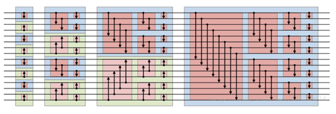
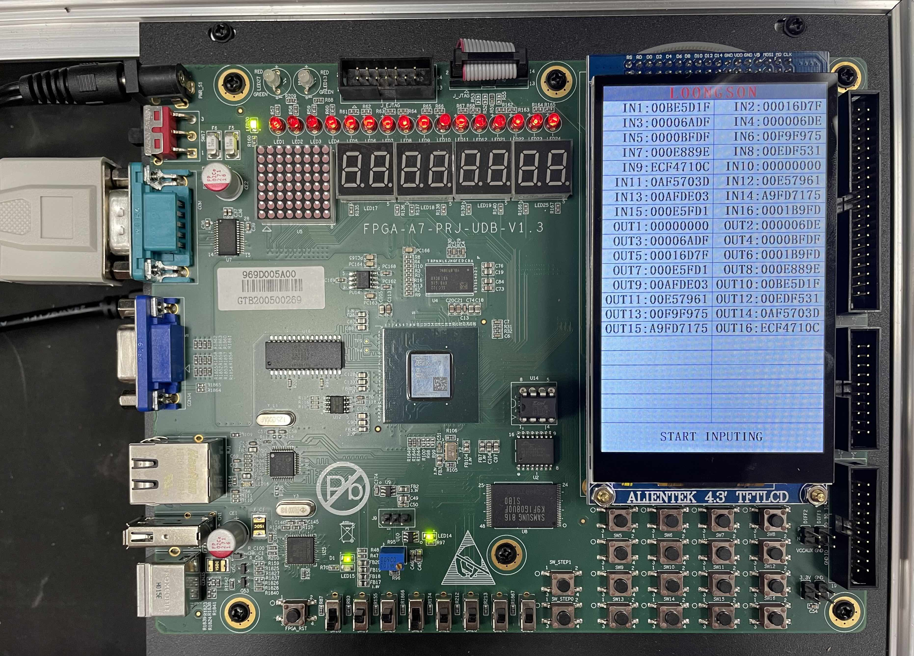
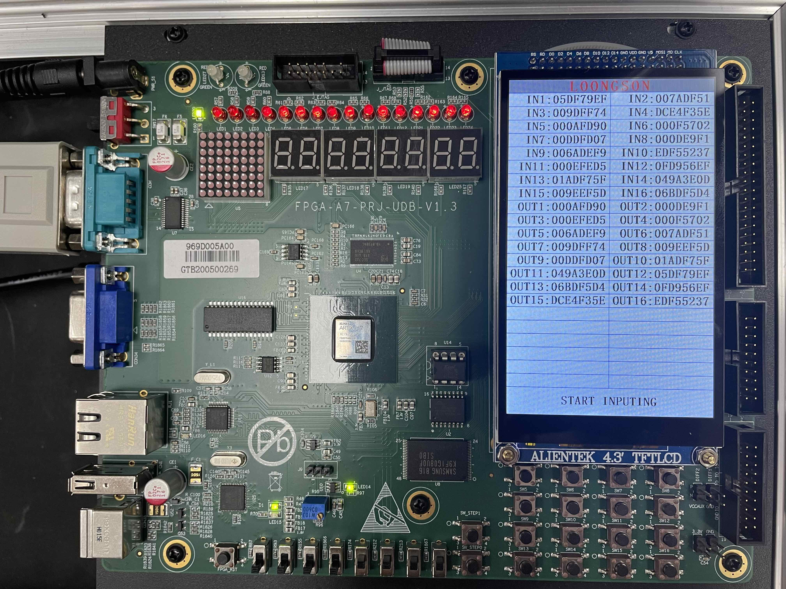

# Sorting_Module 简介

## 设计目标

采用Verilog语言描述一个对16个32位无符号数排序的运算电路。

## 项目环境与描述方式

**设计语言：** Verilog硬件描述语言
**开发环境：** Vivado 2019.2
**测试环境：** LS-CPU-EXB-002实验箱，搭载Xilinx Artix-7 xc7a200tfbg676-2
**描述方式：** 结构化描述方式

## 实现情况

采用双调排序算法，不同模块间并行计算的策略，实现了对输入的16个32位无序无符号数进行排序，并按升序输出的功能。

此电路在Vivado和本地FPGA开发板上均调试运行成功。

# 实现细节

## 算法思想

**双调序列（Bitonic Sequence）**是指由一个非严格增序列X和非严格减序列Y（其中X的最小元素正好是Y的最大元素）构成的序列。

**定义: 一个序列a1,a2,…,an是双调序列（Bitonic Sequence），如果:**

**1.存在一个ak(1≤k≤n),使得a1≥…≥ak≤…≤an成立；或者**

**2.序列能够循环移位满足条件（1）**

简单来说，双调序列是一个先单调递增后单调递减（或者先单调递减后单调递增）的序列。

而双调的归并网络是基于**Batcher定理**而构建的。

**Batcher定理**是说将任意一个长为2n的双调序列A分为等长的两半X和Y，将X中的元素与Y中的元素一一按原序比较，即 a[i]与 a [i + n]( i ≤ n )比较，将较大者放入MAX序列，较小者放入MIN序列。则得到的MAX和MIN序列仍然是**双调序列**，并且MAX序列中的任意一个元素不小于MIN序列中的任意一个元素。再分别对得到的所有MAX和MIN序列进行上述的重复操作，不断缩小序列的规模，直至所有MAX和MIN序列的规模数为2。对于最后得到的每个小序列b[i]而言，满足max(b[i])<=min(b[i+1])，从而实现了整体序列内部元素的有序排列。

因此，对于16个元素，我们可以使用以下步骤实现升序排序：

1. 相邻两个元素，两两之间进行比较，合并形成8个单调性相反的单调序列；
2. 对8个单调序列，两两合并，形成4个双调序列，分别按相反单调性排序，得到4个单调性相反的双调序列；
3. 对4个长度为4的相反单调性单调序列，相邻之间合并，生成两个长度为8的双调序列，分别按相反单调性排序；
4. 对2个长度为8的相反单调性单调序列，相邻之间合并，生成1个长度为16的双调序列，升序排序。

**示意图**

#  明细表

## 模块明细表

| 模块名              | 模块输入              | 模块输出                             | 描述                                                         |
| ------------------- | --------------------- | ------------------------------------ | ------------------------------------------------------------ |
| TestInboard         | *                     | *                                    | 实验箱调试使用                                               |
| Sorting_16          | 16个32位数（乱序）    | 16个32位数（升序）                   | 顶层模块，调用多个子模块以进行排序                           |
| Bitonic_Sequence_4  | 16个32位数（乱序）    | 4组长度为4的双调序列                 | 将16个数分为4组长度为4的双调序列供后续模块使用               |
| Bitonic_Sequence_8  | 4组长度为4的双调序列  | 2组长度为8的双调序列                 | 将4组长度为4的双调序列分为2组长度为8的双调序列供后续模块使用 |
| Bitonic_Sequence_16 | 2组长度为8的双调序列  | 1组长度为16的双调序列                | 将2组长度为8的双调序列分为1组长度为16的双调序列供后续模块使用 |
| ascendingSort_4     | 1组长度为4的双调序列  | 4个32位数（升序）                    | 将长度为4的双调序列转换为升序序列                            |
| ascendingSort_8     | 1组长度为8的双调序列  | 8个32位数（升序）                    | 将长度为8的双调序列转换为升序序列                            |
| ascendingSort_16    | 1组长度为16的双调序列 | 16个32位数（升序）                   | 将长度为16的双调序列转换为升序序列                           |
| Swap                | 2个长度为32的数       | 按大小将两数输出                     | 2个32位数的大小比较模块                                      |
| Comparator_2bit     | 2个2位数              | 三种大小比较结果（大于、等于、小于） | 2个2位数的大小比较模块                                       |
| Comparator_4bit     | 2个4位数              | 三种大小比较结果（大于、等于、小于） | 2个4位数的大小比较模块                                       |
| Comparator_16bit    | 2个16位数             | 三种大小比较结果（大于、等于、小于） | 2个16位数的大小比较模块                                      |
| Comparator_32bit    | 2个32位数             | 三种大小比较结果（大于、等于、小于   | 2个32位数的大小比较模块                                      |
| And_32bit           | 1个32位数,1个1位数    | 1个32位数                            | 根据一位使能信号决定32位数输出与否                           |
| Or_3_32bit          | 3个32位数             | 1个32位数                            | 将三种比较结果中使能信号为真的数据输出                       |

## 文件明细表

| 文件名                    | 包含模块                                                     | 描述                       |
| ------------------------- | ------------------------------------------------------------ | -------------------------- |
| Sorting_Lcd_Module.v      | Sorting_16,  lcd_module                                      | 含lcd的顶层模块            |
| Swap_Module.v             | Swap                                                         | 数据交换                   |
| Sorting_Module.v          | Sorting_16                                                   | 排序顶层模块               |
| Logic_Module.v            | And_32bit,  Or_3_32bit                                       | 逻辑门模块，供最终输出使用 |
| Comparator_Module.v       | Comparator_2bit,  Comparator_4bit,  Comparator_16bit,  Comparator_32bit | 数据大小比较模块           |
| Bitonic_Sequence_Module.v | Bitonic_Sequence_4,  Bitonic_Sequence_8,  Bitonic_Sequence_16 | 双调序列生成模块           |
| ascendingSort_Module.v    | ascendingSort_4,  ascendingSort_8,  ascendingSort_16         | 升序序列生成模块           |
| lcd_module.dcp            | 实验资料自带                                                 | lcd模块                    |

# 上板测试结果

